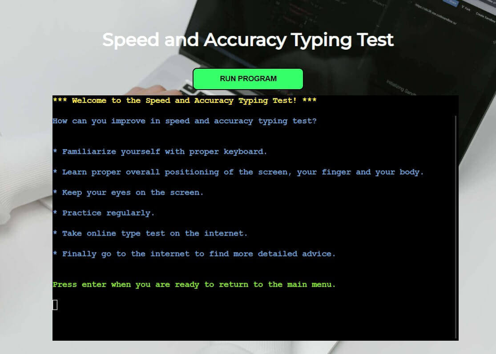
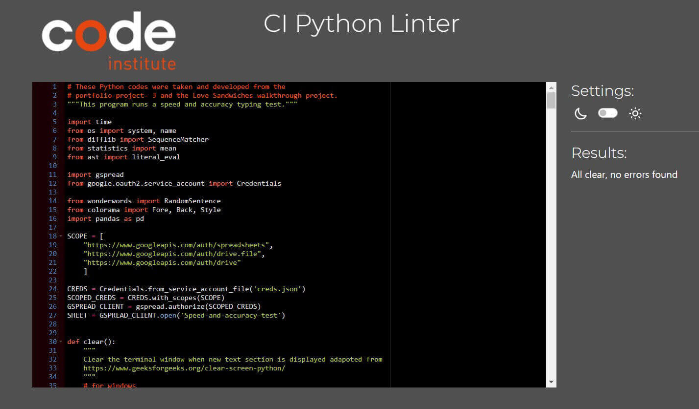

# Speed and Accuracy Typing Test
(Developer: Theresa Wolff)

![Mockup image]

[Live webpage]

## Table of Content

1. [Introduction](#Introduction)
2. [Project Goals](#Project-Goals)

   i. [User Goals](#User-Goals)

   ii. [Site Owner Goals](#Site-Owner-Goals)
3. [User Experience](#User-Experience)

   i. [Strategy](#Strategy)

   * [Target Audience](#Target-Audience)
   * [User Requirements & Expectations](#User-Requirements-&-Expectations)
   * [User Stories](#User-Stories)

   ii. [Scope](#Scope)
   * [Initial Stage](#Initial-Stage)
   * [Future Additions](#Future-Additions)

   iii. [Structure](#Structure)

   iv. [Flowchart](#Flowchart)

   v. [Surface](#Surface)
   * [Color Scheme](#Color-Scheme)
   * [Font](#Font)

   vi. [Features](#Features)
   * [Main Menu](#Main-Menu)
   * [Information Sections](#Information-Sections)
   * [Scoresheet Sections](#Score-Sheet-Sections)
   * [Testing Section](#Testing-Section)
   * [Exit Test](#Exit-Test)
   * [Future Additions](#Future-Additions)

4. [Technologies Used](#Technologies-Used)

   i. [Language](#Languages)

   ii. [Frameworks & Tools](#Frameworks-Tools)

   iii. [Helpful Sites](#Helpful-Sites)
5. [Testing and Validation](#Testing-&-Validation)

   i. [PEP8 Python Linter](#Pep8-ci-Python-Linter)

   ii. [HTML Validation](#HTML)

   iii. [CSS Validation](#CSS)

   iv. [Lighthouse Testing](#Lighthouse)

   v. [User Stories](#User-Stories)

   vi. [Manual Testing](#Manual-Testing)
6. [Bugs & Fixes](#Bugs-&-Fixes)
7. [Deployment & Development](#Deployment-&-development)
8. [Google Sheet Access](#google-sheet-access)
9. [Credits](#Credits)

## Introduction

The Speed and Accuracy Typing Test is a program designed to allow users to test their typing skills, measure their typing speed and accuracy, and save their results to a Google Sheets spreadsheet using the Google Sheets API. It also allows the users to access information such as reading test instructions and tips on improving their skills and score, viewing old scores, deleting their score sheet, and exiting the program. The program is designed in Python and is run through a terminal window.

## Project Goals

### User Goals
* The site's users want to test their typing skills to measure their typing speed and accuracy.
* The user wants to view instructions for effectively using the program and taking the test.
* The user wants to choose a level and start the typing test.
* The user wants to create a score sheet by signing up with a username to save their results and track their progress.		

### Site Owner Goals
* The site owner aims to offer a typing test program to help users measure and improve their typing skills.
* The site owner desires to provide typing Tips and allow users to save their scores.
* The site owner's goal is to encourage users to practice and improve their typing speed and accuracy using the program.
* The owner's goal is to enable the user to return to the test to retest their skill and review previous results.			

## User Experience

### Strategy

#### Target Audience
* Users are interested in testing, monitoring, and improving their speed and accuracy typing skills.
* Users are entering a field of work where typing is essential and who are trying to improve this skill.			

#### User Requirements and Expectations
* Include clear instructions on how to use the program effectively and process flow.
* Simple, easy, and intuitive navigation system.
* Differently, difficulty levels suit their typing skills.
* Scores are to be saved and accessible for future reference. 
* Error handling and immediate feedback on results.

#### User Stories

##### First-time User
As a first-time user, I want to ...
1. ... read test instructions.
2. ... quickly and intuitively move through the test
3. ... know Tips to improve my score and my typing skills.
4. ... sign up with a unique username to save my score.
5. ... select a difficulty level for the typing test.
6. ... see a random paragraph to type accurately and quickly.
7. ... understand how my score fits in with standard averages.
8. ... be able to type the paragraph and receive the test results
9. ... save my results for future reference.

##### Returning Users
As a returning user, I want to ...
1. ... log in using my existing username to access my saved test scores.
2. ... see and access my previous results.
3. ... delete a prior scoresheet if needed.
4. ... take another typing test and save the new test scores.
5. ... see the progress over time in improving my typing skills.

##### Site Owner
As the site owner, I want users to ...
1. ... provide clear instructions and Tips to guide users in using the program.
2. ... provide multiple difficulty levels to cater to users with varying typing skills.
3. ... ensure the accuracy of test results and avoid any potential bugs.
4. ... develop an application that is easy and simple to use.
5. ... handle errors effectively to provide a smooth user experience.
6. ... encourage users to improve their typing skills, save their scores and return to the program.

### Scope

#### Initial Stage

At the early stage, the application will include a main menu where the user can choose from a few options to obtain information, such as instructions and information on improving their typing skills. The user can select a difficulty level (beginner, intermediate, Advanced) for the typing test. The users can take a typing test by typing a random paragraph. The user can also opt to signup, create a username, and use a score sheet to record results; they can review old results and delete a previously developed and populated score sheet. The users can save their test scores to a Google sheet spreadsheet with their username. Then the user will be able to run the test and see immediate feedback in the form of a typing speed in characters/minutes and words/minute as well as a percentage accuracy.										

#### Future Additions

Currently, a Python library called 'Wonderwords' creates a short string of sentences for the user to copy into the terminal window. The sentences are, for the most part, nonsensical and serve the purpose of testing the user's ability to type text by copying it from the terminal window. In a future edition of the application, the developer would like to add Leaderboard to display the top scorers or highest typists on a Leaderboard based on their previous test results. Practice Mode will also be added in the future, where users can practice typing without the pressure of being timed. User Settings will also be added to customize the appearance and behavior of the typing test according to their preferences. Finally, I will also like to calculate efficiency in addition to accuracy.

### Structure

The site's structure consists of a one-page website display containing a terminal window. The Speed and Accuracy Typing Test is run in the terminal window. Above the terminal window, the heading 'Speed and Accuracy Typing Test' is displayed, and a button allows the user to restart the program as many times as desired.

### Flowchart/Skeleton

The following flow chart was created using LucidChart to illustrate the approximate flow of the program and the choices the user can make.

### Surface

The surface has been modified slightly from the provided CI template to add visual appeal to the site. The terminal window is centered in the browser, and a background picture was chosen to fit the application's theme.

#### Color Scheme

The background picture has white and black shades contrasting the background and the terminal window.

The button above the terminal window is a spring green color so that it lifts out from the page and calls for action.

The application uses the Colorama library to add color to the terminal output, making it more visually appealing and user-friendly. The text in the terminal window is colored depending on the type of information displayed or the action called for. Menu options are generally expressed in plain white text. The main welcome message and headers are displayed in Yellow. The blue color is used for showing instructions and tips. Magenta is used for expressing exit messages. Green is used for displaying prompts and user input instructions. Errors messages and invalid input are displayed in red. The colors are defined using the ´Fore´ class from the ´Colorama´ library, combined with the ´Style. BRIGHT´ attribute to make the text more prominent. For example, ´Fore.YELLOW + Style.BRIGHT´ sets the text color to yellow and makes it bright.

#### Font

The font of the heading is Montserrat, which is modern and has a classic look that makes it suitable for headers and logos.

### Features

#### Main Menu

* **A welcome message** is displayed, and the user can choose from a main menu of 8 options on how to proceed.

#### Information Sections

* **Instructions:** Here the user can read and access the instructions for the test.

* **Tips on how to improve:** Here, the user can get information on enhancing and improving their typing speed and accuracy.

#### Sign up and Score Sheet Sections

* **Sign up:** Here, the user can create a username, and the program saves their typing test scores and statistic in a Google Sheets document associated with the username.

* **Access past scores:** The user can access and view a previously saved scoresheet by entering their username and seeing individual results and averages. 

* **Delete a Scoresheet:** The user can enter a username and delete a scoresheet with that name if it exists. 

#### Testing Section

* **Select the difficulty:** The user will be prompted to press enter, select the number for the corresponding level, and press enter again until they are encouraged to start typing. 

* **Commence and Start typing:** The user is prompted to type a random paragraph of sentence lengths based on the user's chosen level(beginner, intermediate, or advanced) as quickly and accurately as possible and press enter to complete the test.

* **Save Results:** The user can exit the test, save the scores, or return to main menu.

#### Exit Section
* **Exit test:** The final choice in the main menu is for the user to exit the program.
 

#### Future Additions

At this time, the paragraph of random sentences created using 'wonderwords' is relatively nonsensical. In a future edition of the application, the developer would like to add Leaderboard to display the top scorers or highest typists on a Leaderboard based on their previous test results. Practice Mode will also be added in the future, where users can practice typing without the pressure of being timed. User Settings will also be added to customize the appearance and behavior of the typing test according to their preferences. Finally, I will also like to calculate efficiency in addition to accuracy.

## Technologies Used

### Languages
* Python

#### Python Libraries

The following libraries are standard in Python and come preinstalled to deal with a variety of contextual issues:

* Time
* OS
* Difflib
* Statistics
* Ast

The following libraries were specifically installed to facilitate various processes specific to this application:

* Gspread: Facilitates accessing and manipulating a Google spreadsheet to save and manipulate data.
* Google.oauth2.service_account.Credentials: This library handled Google service account credentials for authentication.
* Wonderwords: Facilitates the generation of a random paragraph used in the typing test.
* Colorama: This library was used to add color to the terminal output. It also helps make the program more visually appealing and easier to navigate.
* Pandas: This library was used for data manipulation and analysis. It displays a data table in the terminal for easier readability.

### Frameworks & Tools
* Git
* GitHub
* Gitpod
* Heroku
* Google Spreadsheets
* Lucidchart
* CI Python Linter
* W3C HTML and CSS Validation Service
* Google Fonts
* Coolors. co
* TinyPNG
* Mockup Generator

### Helpful sites

The following site was helpful while developing the code to help with problem-solving:

* <a href="https://www.w3schools.com/">W3 Schools</a>
* <a href="https://stackoverflow.com">Stack Overflow</a>
* <a href="https://geekflare.com/python-remove-last-character/">Geekflare</a>
* <a href="https://www.geeksforgeeks.org/clear-screen-python/">Geeksforgeeks</a> 

## Testing and Validation

### PEP8 CI Python Linter

* No errors were found when testing the Python code from run.py in the PEP8 CI Python Linter.

### HTML

* No errors or warnings were found during HTML validation using W3C Markup Validation Service.

### CSS

* No errors were found when validating the CSS using the W3C CSS Validation Service.
 

### Lighthouse

* Excellent scores for Performance, Accessibility, and Best practices in Lighthouse.

### Testing User Stories

**As a first time user, I want to ...**
1. ... read instructions.

| **Feature** | **Action** | **Expected Result** | **Actual Result** |
|-------------|------------|---------------------|-------------------|
| Main Menu | Choose option 1 | Instructions display in the terminal window | Works as expected |

2. ... easily and intuitively move through the test.

| **Feature** | **Action** | **Expected Result** | **Actual Result** |
|-------------|------------|---------------------|-------------------|
| Main Menu | Choose option 4 to start the test | display diffculty levels | Works as expected |
| Test | Follow clear instructions to navigate the test | Test begins | Works as expected |
| End of Test | Make a choice how to proceed | Choice executed | Works as expected |

3. ... get easily understandable results.

| **Feature** | **Action** | **Expected Result** | **Actual Result** |
|-------------|------------|---------------------|-------------------|
| End of test | Finish test | Scores are automatically displayed in terms of speed in characters per minute and words per minute as well as accuracy as a percentage | Works as expected |

4. ... learn how I can improve my score.

| **Feature** | **Action** | **Expected Result** | **Actual Result** |
|-------------|------------|---------------------|-------------------|
| Main Menu | Choose option 2 | Information on how to improve the score is displayed | Works as expected |

5. ... Display the Record.

| **Feature** | **Action** | **Expected Result** | **Actual Result** |
|-------------|------------|---------------------|-------------------|
| Main Menu | Choose option 5 | prompt the user for their username | Works as expected |
| End of Test | Display Result |display all the user Records | Works as expected |

**As a returning user, I want to ...**
1. ... retake the test to see if my score has improved.

| **Feature** | **Action** | **Expected Result** | **Actual Result** |
|-------------|------------|---------------------|-------------------|
| Main Menu | Choose option 4 | Test begins | Works as expected |
| End of test | Save results to existing score sheet | Results are saved to a previously populated score sheet | Works as expected |

2. ... access previous results.

| **Feature** | **Action** | **Expected Result** | **Actual Result** |
|-------------|------------|---------------------|-------------------|
| Main Menu | Choose option 5 and input saved scoresheet name | Previous results and averages are displayed | Works as expected | 

3. ... delete a score sheet.

| **Feature** | **Action** | **Expected Result** | **Actual Result** |
|-------------|------------|---------------------|-------------------|
| Main Menu | Choose option 6 and input saved scoresheet name to be deleted follow prompts | Scoresheet will be deleted | Works as expected | 

**As the site owner, I want to ...**
1. ... develop an application that is easy to use.

| **Feature** | **Action** | **Expected Result** | **Actual Result** |
|-------------|------------|---------------------|-------------------|
| Main Menu | Choose an option | Option is executed | Works as expected |
| Return to Main Menu | At the end of each option return to menu is an option | User is taken back to the main menu | Works as expected |

2. ... provide clear instructions of the application.

| **Feature** | **Action** | **Expected Result** | **Actual Result** |
|-------------|------------|---------------------|-------------------|
| Main Menu | Choose option 1 | Instructions display in the terminal window | Works as expected |

3. ... provide the user with additional information on how to improve.

| **Feature** | **Action** | **Expected Result** | **Actual Result** |
|-------------|------------|---------------------|-------------------|
| Main Menu | Choose option 2 | Information on how to improve the score is displayed | Works as expected |

4. ... allow the user to save their scores and return to return to main menu and improve their scores.

| **Feature** | **Action** | **Expected Result** | **Actual Result** |
|-------------|------------|---------------------|-------------------|
| End of test | Save results to existing or new score sheet | Results are saved to a score sheet | Works as expected |
| Return to main menu | At the end of test, save results and return to main menu | Main menu is displayed | Works as expected |
| Main Menu | Choose option 4 | Test begins again | Works as expected |
| Main Menu | Choose option 5 and input saved scoresheet name | Previous results and averages are displayed | Works as expected | 

### Manual Testing

The flow of the program was tested extensively using valid and invalid input data at every stage and ensuring that the program functions as intended for a smooth user experience. All errors that did occur during this testing phase were fixed. No more errors should occur. 

### Outstanding Issues

There are currently no outstanding issues that the developer is aware of.

## Bugs & Fixes

1. After the typing test, if the user puts a name not in the worksheet, it throws up an error and crashes the program.

* I fixed this issue by creating an Exception to handle the "WorksheetNotFound" error.

2. When trying to access my Google sheet, it didn't connect, sighting invalid credentials.

* I fixed this error using scope variables from the Love Sandwiches walkthrough project.

3. Incorrect calculation of typing speed.The program miscalculates the typing speed, leading to inaccurate results displayed to the user.

* I Ensure I correctly calculate the typing speed by considering the number of characters typed and the time taken. 

## Deployment & Development

The website was deployed on Heroku. The following steps were followed for a complete and functional deployment:

1. The requirements.txt file was populated using the command "pip3 freeze > requirements.txt'
2. Any text inside the 'input()' function in the run.py file had a 'new line' command (\n) added to work correctly with the Code Institute template.
3. Once logged into the Heroku dashboard, a new app was created by clicking on the button 'New' and selecting 'Create New App.'
5. The app was named 'speed-and-accuracy-typing-test,' and the region 'Europe' was selected.
6. Under 'Setting' in the newly created app, 'Reveal Config Vars' was clicked to set environment variables such as sensitive information.
7. For the input field labeled 'KEY,' the word 'CREDS' was entered in all capitals.
8. The entire contents of the projects creds.json file were pasted into the 'VALUE' field.
9. A second config var was added with the KEY set to 'PORT' and the VALUE set to '8000'.
10. Each time 'ADD' was clicked to add the config var.
11. Next, still under the settings tab, Buildpacks were added.
12. 'Add Buildpack' was clicked, Python was selected, then 'Save Changes.'
13. Next, nodejs were added, and 'Save Changes' clicked. 
14. In the list of Buildpacks, Python needs to be listed above nodejs; if not, drag the buildpacks into the correct order.
15. This concluded the 'Settings' of the project.
16. Next, the 'Deploy' section was accessed by clicking on the 'Deploy' tab.
17. In the 'Deploy' section, GitHub was selected, and then the project on GitHub was searched for; it has the name 'portfolio-project-3'. 
18. The project was then connected to Heroku by clicking 'connect.'
19. Next, 'Enable Automatic Deploys' was selected so that the app would be updated automatically every time changes are pushed to GitHub.
20. Then, 'Deploy Branch' was clicked, and the app was built.
21. The link to the deployed page is: https://speed-and-accuracy-typing-test-1d306fdf70ec.herokuapp.com/

The following steps can fork the website repository:

1. Go to the GitHub repository.
2. Click on the Fork button in the upper right-hand corner.

The following steps can clone the repository:

1. Go to the GitHub repository.
2. Locate the Code button above the list of files and click on it.
3. Select if you prefer to clone using HTTPS, SSH, or Github CLI, and click the copy button to copy the URL to your clipboard.
4. Open Git Bash.
5. Change the current working directory to where you want the cloned directory.
6. Type git clone and paste the URL from the clipboard ($ git clone https://github.com/YOUR-USERNAME/YOUR-REPOSITORY)
7. Press Enter to create your local clone.

## Google Sheet Access

The following information is for the assessors of this project. A link to the Google sheet that is used to store, retrieve and delete data as part of the Speed Typing Test can be found here:[Google Sheet](https://docs.google.com/spreadsheets/d/1k_ORO0crgzu3ndA8O4BGPD9BNnHFrwbIqGqSsJo34mU/edit#gid=108714422).

Please note that there is a prepopulated worksheet named **'typing_test3'**, which the assessors can use to test the program's functionality. Additional results can be written on this worksheet, but they must be retained. 

## Credits

### Media

* The background image was taken from [pexels](https://www.pexels.com).

### Code

Resources and inspiration came from a few sources:

* The initial idea to develop a speed and accuracy typing test and parts of the code came from [Bharath K](https://towardsdatascience.com/speed-typing-test-project-with-python-da1a56987a5b), [Ulrike Riemenschneider
](https://github.com/URiem/portfolio-project-3) and [Love Sandwiches walkthrough project](https://love-sandwiches-game-918ce8868871.herokuapp.com). It was subsequently heavily developed and extended. 
* Ideas for how to adjust the styling of the CI template came from [Iasmina Pal](https://github.com/useriasminna/american_pizza_order_system) and [Ivette McDermot](https://github.com/IvetteMcDermott/PP3-Python).
* Research on ideas how to compare two string lead the developer to the following page of ideas: [How to Compare Two Strings in Python](https://miguendes.me/python-compare-strings)

 
 

